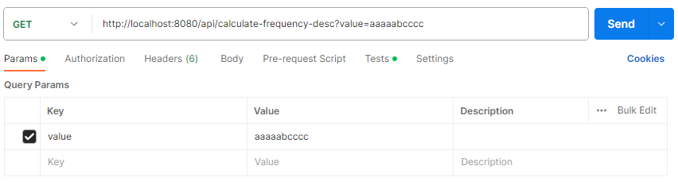

# Документация к заданию по реализации REST API, вычисляющее частоту встречи символов по заданной строке
## Работа с Git 
### Клонирование проекта
1. На странице репозитория нажмите на зеленую кнопку **"Code"**

3. В выпадающем окне скопируйте ссылку на репозиторий

4. Перейдите в **Intellij IDEA -> вкладка File -> New -> Get From Version Control** -> в поле URL вставьте скопированную вами ссылку на репозиторий и нажмите **"Clone"**.

## Работа с проектом
### Настройка проекта
Дополнительная настройка проекта не требуется, Tomcat автоматически присвоит URL http://localhost с портом 8080.
### Запуск проекта
Для запуска проекта перейдите в класс ProjectApplication, аннотированный как @SpringBootApplication и нажмите "Run"
Теперь у вас запущена локальная сеть **http://localhost:8080**

## Работа с API
### Endpoints
Для работы с API на выбор вам доступно три эндпоинта:
1. **GET: /api/calculate-frequency** - вычисляет частоту встречи символов по заданной строке без дальнейшей сортировки
2. **GET: /api/calculate-frequency-asc** - вычисляет частоту встречи символов по заданной строке с сортировкой по возрастанию
3. **GET: /api/calculate-frequency-desc** - вычисляет частоту встречи символов по заданной строке с сортировкой по убыванию

### Передача и получение параметров (далее будет показана работа с API с помощью Postman)
1. Откройте Postman и в боковой панели выберите вкладку **Collections -> RESTful API Basics -> Get Data**
   

3. В поле **Enter URL** вставьте путь до какого-либо эндпоинта (на примере этот: http://localhost:8080/api/calculate-frequency-desc)
   

5. Во вкладке Params нам необходимо передать параметры в виде пары **"ключ-значение"**. Ключем должен быть параметр **"key"**, а значение - это то, какую строку вы хотите передать ("на примере это "aaaaabcccc")
6. После того, как вы введёте key-value пару, Postman автоматически создаст готовый URL для отправки GET-запроса.
7. Нажмите **"Send"** и в случае, если вы всё сделали верно, API вернет нам тело ответа с кодом статуса "200". Тело ответа вы можете просмотреть внизу во вкладке **Body** в любом доступном формате (JSON, XML и т.п.)
   

## Работа со Swagger
**Swagger** - это фреймворк, позволяющий автоматически, на основании кода и аннотаций генерировать и обновлять интерактивную веб-документацию (Swagger UI) на REST API.
Для целей документации, по минимуму методы контроллера помечаются аннотацией например так: **@ApiOperation("Получение списка всех пользователей")**
Документацию по созданным API можно просматрировать по данной ссылке: **http://localhost:8080/swagger-ui/index.html**

